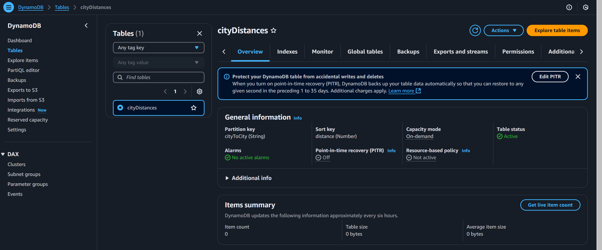
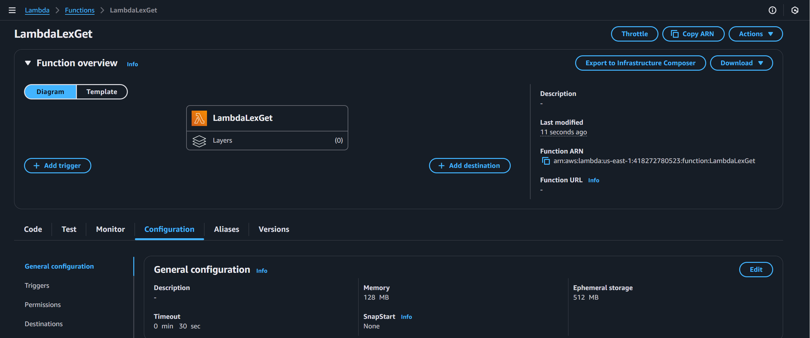
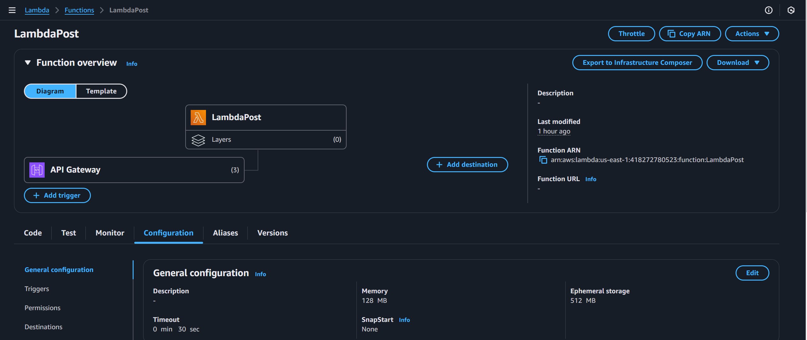
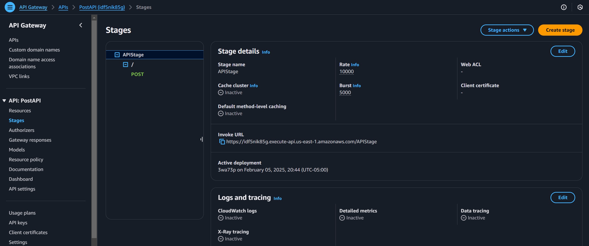
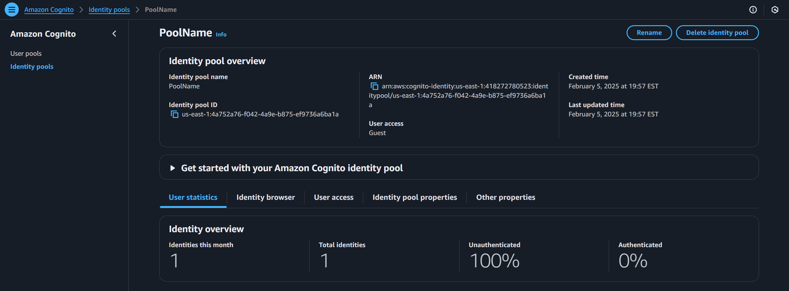
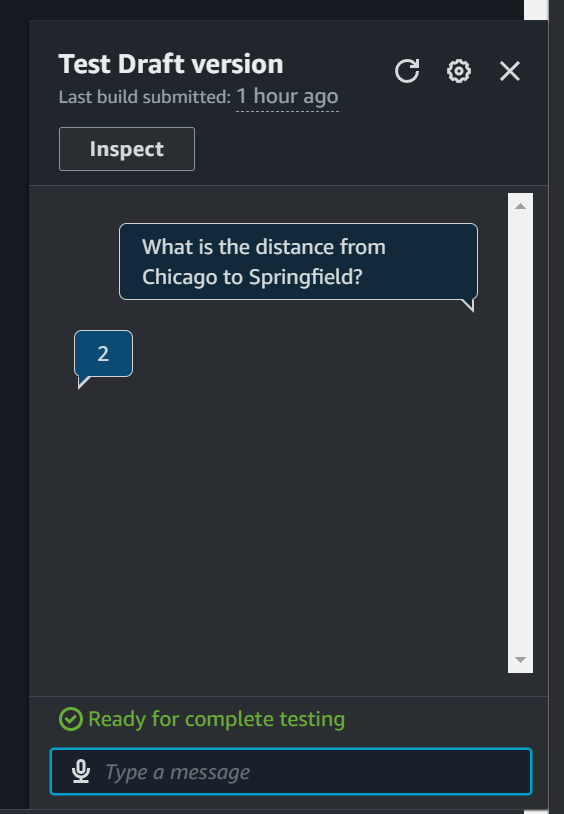
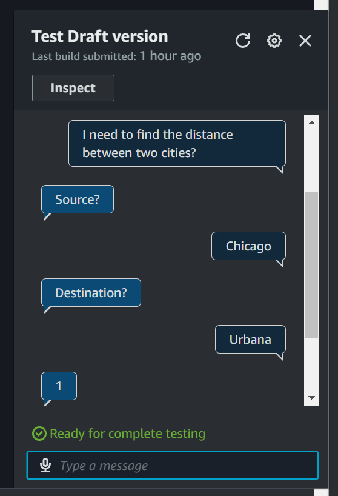

# DataWhisperer-AI

## Overview

I implemented a chatbot using AWS Lex that interacts with DynamoDB to retrieve information about cities and calculates the shortest distance between two cities in a directed graph. 

The project utilizes the following AWS services:

* **AWS Lambda:**  Two Lambda functions are used - one for creating the graph in DynamoDB and another for interacting with Lex to retrieve distances.
* **AWS API Gateway:**  Provides a REST API endpoint to interact with the graph creation Lambda function.
* **AWS DynamoDB:**  Stores the graph data, including cities (nodes) and distances (edges).
* **AWS Lex:**  The chatbot service that interacts with users, gathers city information, and returns the shortest distance.
* **AWS Cognito:**  Used for authentication and authorization to access the Lex chatbot.

Given two cities and based on the user's query, the DataWhisperer-AI chatbot can calculate: 
* the shortest distance between two cities in a directed graph calculate
* average time it would take to travel based on transportation
* the time difference
* and more features can be included by modifying the dataset and Lex-chatbot

## AWS DynamoDB

* **Table:** A DynamoDB table is created to store the graph data.
    * **Primary Key:** `source, destination` (city namem, city name)
    * **Attributes:** `distance`: The shortest distance between the source and destination cities.

* **Data Population:** The `AWS Lambda Post Function` (described below) populates this table based on the input graph.

## AWS Lambda - Get Method

This Lambda function is integrated with AWS Lex.

* **Trigger:** Invoked by the Lex chatbot when a user requests the distance between two cities.
* **Functionality:**
    1. Retrieves the `source` and `destination` cities from the Lex intent.
    2. Queries the DynamoDB table to fetch the `distance` between the given cities.
    3. Returns the `distance` to the Lex chatbot for displaying to the user.

## AWS Lambda - Post Method

This Lambda function is responsible for creating the graph in DynamoDB.

* **Trigger:** Invoked via a POST request to the API Gateway endpoint.
* **Functionality:**
    1. Receives the graph data in the request body as a string (e.g., `{"graph": "Chicago->Urbana,Urbana->Springfield,Chicago->Lafayette"}`).
    2. Parses the graph data to extract nodes and edges.
    3. Implements Breadth-First Search (BFS) algorithm to calculate the shortest distance between all pairs of cities.
    4. Stores the calculated distances in the DynamoDB table.
    5. Returns a 200 OK status code upon successful completion.

## AWS API Gateway

* **Endpoint:** Creates a POST endpoint that triggers the `AWS Lambda - Post Method` function.
* **Integration:**  Integrates the endpoint with the Lambda function to pass the request body containing the graph data.

## AWS Lex

* **Intent:**  An intent is created to capture the user's request for finding the distance between cities.
    * **Utterances:**  Sample utterances are defined to train the Lex bot to recognize the intent (e.g., "What is the distance from Chicago to Springfield?", "I need to find the distance between two cities").

* **Slots:** Two slots are defined within the intent:
    * **Source:** Represents the starting city.
    * **Destination:** Represents the destination city.
    * **Slot Type:** `AMAZON.City` is used for both slots to ensure valid city names are captured.

* **Fulfillment:** The Lex intent is configured to use the `AWS Lambda - Get Method` function for fulfillment. This means that after the user provides the source and destination cities, the Lambda function is invoked to retrieve the distance from DynamoDB.

### AWS Cognito

* **Identity Pool:** An identity pool is created in Cognito to manage user authentication and authorization.
* **IAM Roles:**  Appropriate IAM roles are configured to allow users to interact with the Lex chatbot.

## Tests

* **Manual Testing:** You can interact with the Lex chatbot directly through the Lex console to test different scenarios.
* **Automated Testing:** The `submit.py` script can be used to automate the testing process. It sends requests to the API Gateway to populate the graph and then interacts with the Lex chatbot to verify the distance calculations.

